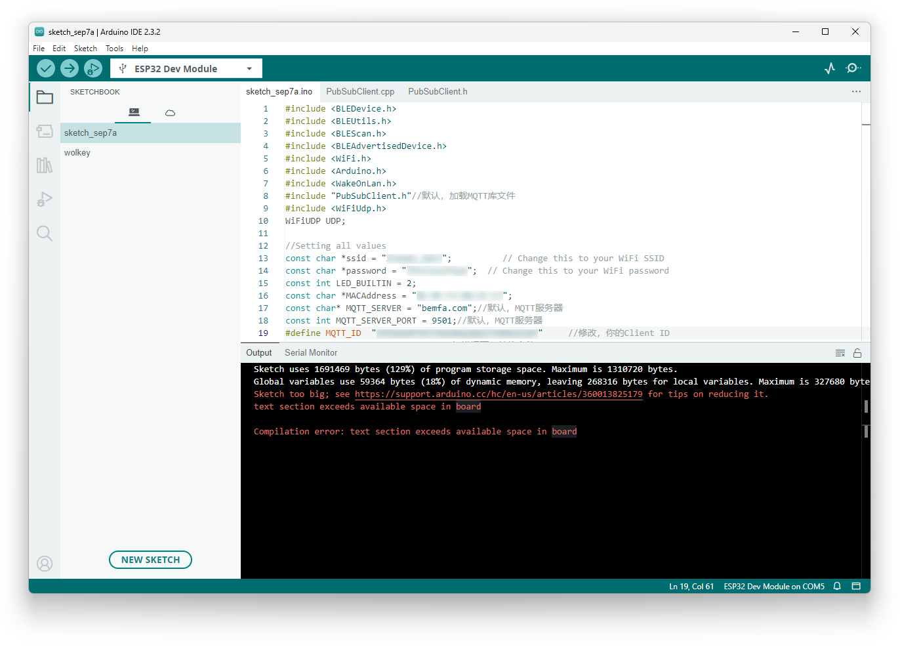
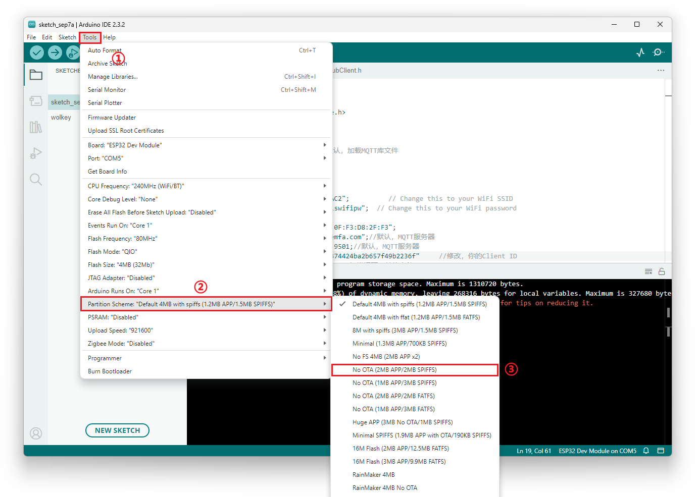
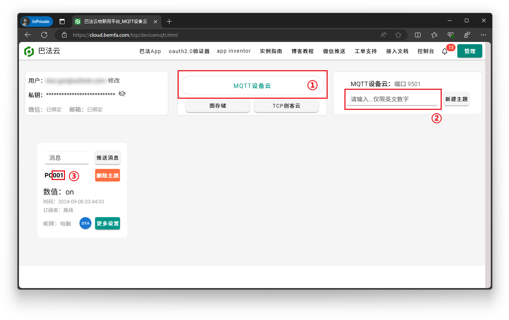

# 适用于PC的多功能按钮（带WOL功能）

使用Esp32实现远程、本地的笔记本开关机操作，无需拆机无损改造，并通过巴法云接入智能家居平台，实现小爱同学、天猫精灵、小度等智能设备远程控制。

<!-- PROJECT SHIELDS -->

[![Contributors][contributors-shield]][contributors-url]
[![Forks][forks-shield]][forks-url]
[![Stargazers][stars-shield]][stars-url]
[![Issues][issues-shield]][issues-url]

<!-- PROJECT LOGO -->
<br />
<br />
<p align="center">
  <a href="https://github.com/KongWZGordon/ESP32-WOL-Smart-Key/">
    
  </a>

  <h3 align="center">"一键"掌控你的电脑</h3>
  <p align="center">
    一个为你电脑加上快捷按键并接入智能家居平台的项目！
    <br />
    <br />
    ✅ 语音开关机 ✅ 远程开机 ✅ 智能按钮开关机 ✅ 长按、双击动作识别 ✅ 自定义功能 ✅ 查询状态
    <br />
    <br />
    <a href="https://github.com/KongWZGordon/ESP32-WOL-Smart-Key/issues">报告Bug</a>
    ·
    <a href="https://github.com/KongWZGordon/ESP32-WOL-Smart-Key/issues">提出新特性</a>
  </p>

</p>

## 目录

- [测试使用环境与设备](#测试使用环境与设备)
- [使用文档](#使用文档)
  - [Arduino配置](#Arduino配置)
  - [巴法云注册&密钥获取](#巴法云注册)
  - [烧录代码](#烧录代码)
  - [接入语音助手](#接入语音助手)
    

由于米家无法支持个人开发者，因此本项目的小爱同学互联使用[巴法云](https://bemfa.com/)实现，智能按键控制不经过米家，直接通过ESP处理蓝牙广播包。目前只发现了这种方法，后续有更好的实现方式再迭代。

### 测试使用环境与设备
+ [ESP32WROOM32](https://www.espressif.com.cn/sites/default/files/documentation/esp32-wroom-32_datasheet_cn.pdf)
+ 笔记本电脑（Realtek RTL8118AS）
+ Winodws 11 23H2
+ [PTX 无线开关（蓝牙版）](https://home.mi.com/webapp/content/baike/product/index.html?model=090615.remote.btsw1)


### 使用文档

> 本项在互联方面涉及使用第三方平台，不能保证其代码和实现方式长期有效。

#### **Arduino配置**
1. 针对如何配置Arduino环境以及连接ESP32开发板的具体操作，这里暂且掠过。需要注意的是，**默认配置下同时涉及蓝牙和Wifi相关的库，会让编译出现超出储存大小的报错**：
   
   因此需要设置一下分区表，使其划分给App的空间足够大，这里我们使用`NO OTA (2MB APP/2MB SPIFFS)`作为演示。
   

2. 导入[巴法云](https://cloud.bemfa.com/)相关的库

   ```cpp
   #include "PubSubClient.h"//默认，加载MQTT库文件
   ```

   注意将`PubSubClient.h`与`PubSubClient.cpp`放到`*.ino`相同的目录底下，[相关文件](https://cloud.bemfa.com/zip/8266/Bemfa_MQTT.zip)可以在巴法云获取。
   
#### **巴法云注册&密钥获取**
1. 通过官网注册一个账号并打开控制台界面
   
   + 选择到mqtt设备云
   + 随便起一个以001结尾的名字（001用于识别系统类型必须在末尾带有，[详见文档](https://cloud.bemfa.com/docs/src/speaker_mi.html)）

2. 记录好用户私钥(页面左上)以及刚才的名字，后续配置需要用到。

#### **PTX开关MAC地址获取**
> 两种方法任选其一即可，**完成这一步后请将按钮配网**
##### 方法一 通过Xiaomi Cloud Tokens Extractor获取
1. 获取的方式多样，这里推荐使用Github上另一个项目——[Xiaomi Cloud Tokens Extractor](https://github.com/PiotrMachowski/Xiaomi-cloud-tokens-extractor/)进行，优点是不需要自己去抓包筛选，登录就可以看到设备相关信息。
2. 使用米家app按照官方的教程对按键进行配网，这一步即使没有网关也可以进行。
3. 成功后打开Extractor，输入绑定按钮的账号密码登录，会发现`PTX wireless switch(bluetooth version)`的设备其中`MAC`便是我们需要的，记录其地址。
   

##### 方法二 通过BLE扫描获取
1. 你也可以通过BLE设备调试软件扫描获取，例如[nRF Coonnect安卓版](https://play.google.com/store/apps/details?id=no.nordicsemi.android.mcp&hl=en_US)
   > 如**已经配网**请注意：配网后的蓝牙只会在按下一刻开启，非常难以捕捉。如果你已经配网，又不想重新配一次，可以尝试打开`nRF Coonnect`的扫描状态，按几下按钮，然后在列表里寻找包含`remote.btsw`字眼的设备（详见第三步）。
2. 根据[PTX官方说明书](https://home.mi.com/views/introduction.html?model=090615.remote.btsw1&region=cn)，快按3下再长按5秒直到开关指示灯变闪烁，使开关进入配网状态。
3. **配网状态下**，设备的蓝牙是可见的状态。打开`nRF Coonnect`，你可以轻松地找到包含`remote.btsw`字眼的设备，记录下它的MAC地址。

#### **烧录代码**
1. 根据注释内容的及提示修改此部分代码：

   ```cpp
   /*===========================⇩ ⇩ ⇩ 这部分是需要修改的信息 ⇩ ⇩ ⇩================================*/
   #define MQTT_ID  "这里填写你的用户私钥"     //修改，你的Client ID
   const char *ssid = "这里填写WiFi名字";          // 你的Wifi名字
   const char *password = "这里填写WiFi密码";  // 你的Wifi密码
   const char *MACAddress = "XX:XX:XX:XX:XX:XX"; // 电脑设备的MAC地址
   String targetMac = "XX:XX:XX:XX:XX:XX";  // PTX设备的MAC地址
   /*===========================⇧ ⇧ ⇧ 这部分是需要修改的信息 ⇧ ⇧ ⇧================================*/
   ```

2. 完成后可以尝试烧录。
3. 烧录完成后，此时按动PTX开关应该会有蓝灯闪烁两下。同时打开巴法云的[控制台](https://cloud.bemfa.com/tcp/devicemqtt.html)，应该可以看到设备上线状态。

#### **接入语音助手**


<!-- links -->
[your-project-path]:shaojintian/Best_README_template
[contributors-shield]: https://img.shields.io/github/contributors/KongWZGordon/WOL-Remote-Button-Base-on-ESP32.svg?style=flat-square
[contributors-url]: https://github.com/KongWZGordon/WOL-Remote-Button-Base-on-ESP32/graphs/contributors
[forks-shield]: https://img.shields.io/github/forks/KongWZGordon/WOL-Remote-Button-Base-on-ESP32.svg?style=flat-square
[forks-url]: https://github.com/KongWZGordon/WOL-Remote-Button-Base-on-ESP32/network/members
[stars-shield]: https://img.shields.io/github/stars/KongWZGordon/WOL-Remote-Button-Base-on-ESP32.svg?style=flat-square
[stars-url]: https://github.com/KongWZGordon/WOL-Remote-Button-Base-on-ESP32/stargazers
[issues-shield]: https://img.shields.io/github/issues/KongWZGordon/WOL-Remote-Button-Base-on-ESP32.svg?style=flat-square
[issues-url]: https://img.shields.io/github/issues/KongWZGordon/WOL-Remote-Button-Base-on-ESP32.svg
